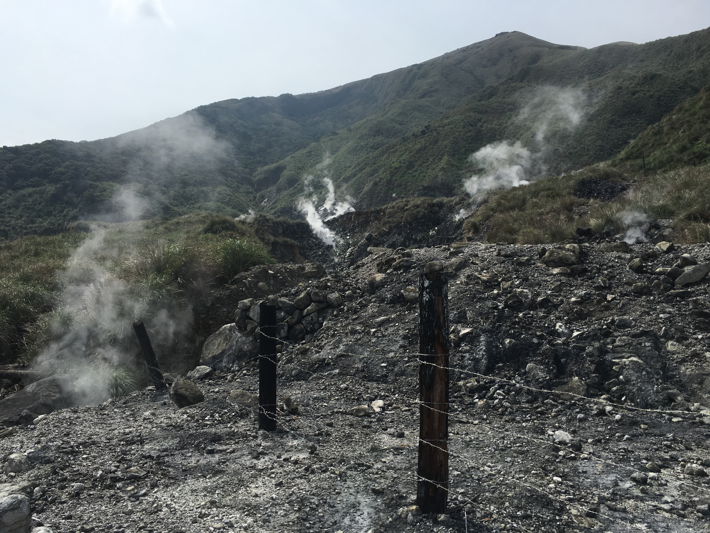

```{r setup, include=FALSE}
library(magrittr)
library(knitr)
library(leaflet)
library(plotly)
```

# Data collation

I split last eruption time, tectonic/setting and creat new columns.  

```{r, message=FALSE, warning=FALSE}
setwd('c:/Kaggle_funny/volcano_Kaggle')
volcano_df_raw <- read.csv('data/database.csv')
subUnkown <- sub("Unknown",replacement ="Unknown Unknown",volcano_df_raw$Last.Known.Eruption) # copy two unknown value for spliting (複製兩欄unknown方便後續切分)
splitTime <- strsplit(as.character(subUnkown), split=" ", fixed=T) # split(切分)

# recollation (將資料重新整理)
## Part of Last eruption Time
year <- c()
yearCE <- c()
for(i in 1:length(subUnkown)){
  year <- c(year, splitTime[[i]][1])
  yearCE <- c(yearCE,  splitTime[[i]][2])
}
Last_Eruption <- data.frame(year, yearCE)
# if my time data is before Christian era, I let it * -1. 
CEyearTransfrom <- ifelse(Last_Eruption$yearCE=="BCE", as.numeric(as.vector(Last_Eruption$year))*-1, as.numeric(as.vector(Last_Eruption$year))*1)
Last_Eruption <- cbind(Last_Eruption, last_time_eruption = CEyearTransfrom)
volcano_df_raw <- cbind(volcano_df_raw, Last_Eruption) # bind new time columns to data frame (增加進總表)

## Part of tectonic data
splitTectonic <- strsplit(as.character(volcano_df_raw$Tectonic.Setting), split="/", fixed=T) # split
tectonic_type <- c()
crust_type <- c()
for(i in 1:length(volcano_df_raw$Tectonic.Setting)){
  tectonic_type <- c(tectonic_type, splitTectonic[[i]][1])
  crust_type <- c(crust_type,  splitTectonic[[i]][2])
}
tectonic_df <- data.frame(tectonic_type, crust_type)
tectonic_df$crust_type <- sub(" ",replacement ="", tectonic_df$crust_type)

volcano_df_raw <- cbind(volcano_df_raw, tectonic_df)# bind new Tectonic columns to data frame (增加進總表)

showTable <- data.frame(volcano_df_raw[,2], volcano_df_raw[,8:9], volcano_df_raw[,15:17])

kable(showTable[1:20, ], caption = "volcano_df")
```

# Map 

Drawing a map with known eruption record.
```{r, out.width='80vw'}
# drawing a map with known eruption record
class_tectonic <- unique(volcano_df_raw$Tectonic.Setting) # Check about how many class of Tectonic Setting
Drop_unknown_eruption <- subset(volcano_df_raw, volcano_df_raw$yearCE!="Unknown")
pal <- colorFactor(c("navy", "red", "yellow", "pink", "green", "blue", "black", "lightgreen", "lightblue", "orange", "purple", "grey"), domain = c(as.character(class_tectonic)))

known_eruption_volcano_map <- leaflet(data = Drop_unknown_eruption) %>%
  setView(lng = 90.00, lat = 0.00, zoom = 3) %>%
  addProviderTiles("Esri.WorldImagery") %>%
  addCircleMarkers(lng = Drop_unknown_eruption$Longitude,
                   lat = Drop_unknown_eruption$Latitude,
                   popup =~as.character(Drop_unknown_eruption$last_time_eruption),
                   radius = 5,
                   weight = 1,
                   opacity = 0.8,
                   fill = TRUE,
                   fillOpacity = 0.8,
                   fillColor = ~pal(Drop_unknown_eruption$Tectonic.Setting),
                   color = "pink") %>%
  addLegend("bottomright",
            pal = pal,
            values = ~Drop_unknown_eruption$Tectonic.Setting,
            title = "Tectonic Setting",
            opacity = 1)

known_eruption_volcano_map

```

# Clustering

Trying to use K-means to Cluster our volcanoes with last eruption time and location.

## looking for a best K number 

Trying to looking for a best K number of k-means.
```{r, message=FALSE, warning=FALSE}
VC_km <- data.frame(name = Drop_unknown_eruption$Name, 
                    lat = Drop_unknown_eruption$Latitude,
                    lng = Drop_unknown_eruption$Longitude,
                    erupt_time = Drop_unknown_eruption$last_time_eruption,
                    tectonic_type = Drop_unknown_eruption$tectonic_type,
                    crust_type = Drop_unknown_eruption$crust_type)

VC_km_1 <- VC_km[, 2:4]
# checking our WSS(Within Cluster Sum of Squares) with K number.

ratio_ss <- rep(NA, times = 12)
for (k in 1:length(ratio_ss)) {
  fit_km <- kmeans(VC_km_1, centers=k, nstart=20)
  ratio_ss[k] <- fit_km$tot.withinss/fit_km$totss
}
ratio_ss_df <- data.frame(Kn =  c(1:length(ratio_ss)), ratio_ss)
plot_ly(data = ratio_ss_df,x =~ratio_ss_df$Kn, y=~ratio_ss_df$ratio_ss, type = "scatter", mode = "markers+lines")
```

I think I want to choose K = 4.
```{r}
# I think I want to choose K = 4.
# useing K=4, and let's go.
set.seed(2017)
VC_kmeans <- kmeans(VC_km_1, nstart = 20, centers = 4)
table(VC_kmeans$cluster)

```

## Plot a histogram 

figure to observe the result of clustering
```{r}
VC_km <- cbind(VC_km, cluster = VC_kmeans$cluster)
VC_km <- subset(VC_km, VC_km$tectonic_type!="NA")
VC_km_C1 <- subset(VC_km, VC_km$cluster==1)
VC_km_C2 <- subset(VC_km, VC_km$cluster==2)
VC_km_C3 <- subset(VC_km, VC_km$cluster==3)
VC_km_C4 <- subset(VC_km, VC_km$cluster==4)

tectonic_class_count <- function(vc_df) {
  type_count <- c()
  tectonic_class <-  unique(VC_km$tectonic_type)
  for(i in 1:3){
    type_count <- c(type_count, subset(vc_df, vc_df$tectonic_type==tectonic_class[[i]]) %>% nrow())
  }
  return(type_count)
}

vc_count_df <- data.frame(type = unique(VC_km$tectonic_type)[1:3], 
                          cluster_1 = tectonic_class_count(VC_km_C1),
                          cluster_2 = tectonic_class_count(VC_km_C2),
                          cluster_3 = tectonic_class_count(VC_km_C3),
                          cluster_4 = tectonic_class_count(VC_km_C4)
                          )
# plot
plot_ly(alpha = 0.6) %>%
  add_histogram(x = VC_km_C1$erupt_time, name = "cluster1") %>%
  add_histogram(x = VC_km_C2$erupt_time, name = "cluster2") %>%
  add_histogram(x = VC_km_C3$erupt_time, name = "cluster3") %>%
  add_histogram(x = VC_km_C4$erupt_time, name = "cluster4") %>%
  layout(barmode = "overlay")


```

## Draw a new Map

Draw a map with result of clustering
```{r, message=FALSE, warning=FALSE}
# Draw a map with result of clustering
pal <- colorFactor(c("blue", "yellow", "green", "red"), domain = c(1:4))

cluster_volcano_map <- leaflet(data = VC_km) %>%
  setView(lng = 90.00, lat = 0.00, zoom = 3) %>%
  addProviderTiles("Esri.WorldImagery") %>%
  addCircleMarkers(lng = VC_km$lng,
                   lat = VC_km$lat,
                   popup =~as.character(VC_km$erupt_time),
                   radius = 5,
                   weight = 1,
                   opacity = 0.8,
                   fill = TRUE,
                   fillOpacity = 0.8,
                   fillColor = ~pal(VC_km$cluster),
                   color = "black") %>%
  addLegend("bottomright",
            pal = pal,
            values = ~VC_km$cluster,
            title = "erupt time",
            opacity = 1)

cluster_volcano_map

```